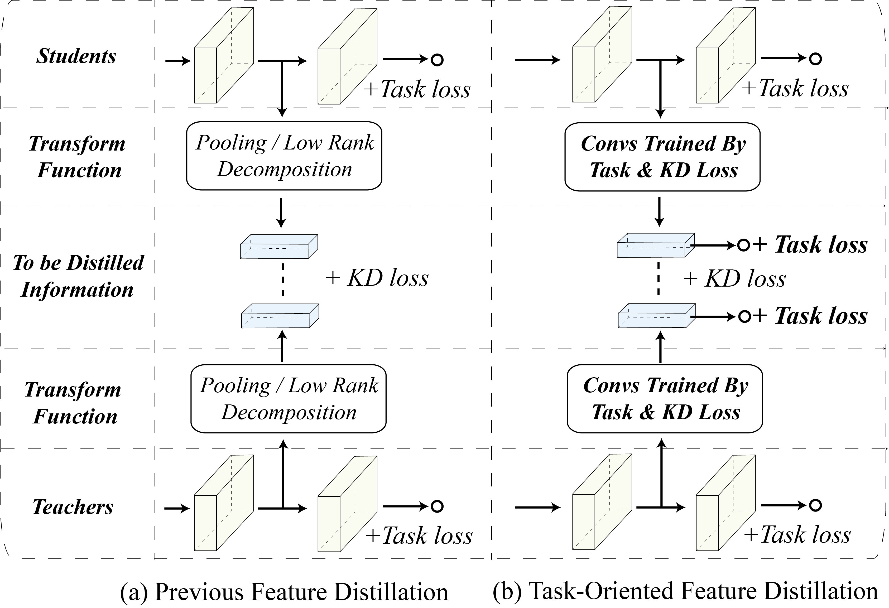

# Task-Oriented Feature Distillation 

This is the implementation of ,  NeurIPS2020.

## Experiments on CIFAR100

**Step1.** Install the required packages. 

```shell
pip install torch torchvision
```

**Step2**. Train a student  model. 

```python
python distill.py --model=resnet18
```

Note that you can choose resnet, senet and preactresnet models as students. Each model has five kinds of depth - 18, 34, 50, 101, and 152. 

## Illustration of Method

 
